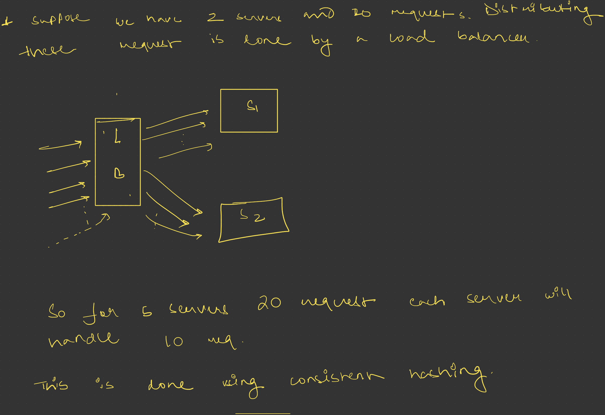

# Types of Load Balancers — Interview Focused Deep Dive

This is one of the most important areas in system design interviews because interviewers want to know:

- Can you route traffic correctly?
- Can you choose the right LB for the workload?
- Do you understand network layers?
- Can you reason about performance vs flexibility tradeoffs?

For senior engineer interviews, simply saying:

> “Use a load balancer”

is not enough.

You must explain:

- WHICH type
- WHY
- WHAT traffic
- WHAT tradeoff
- WHAT bottleneck
- WHAT scale

## 1. First Understand the Real Purpose of Load Balancers

Most beginners think:

> “Load balancer distributes traffic.”

That is only partially correct.

Senior-level understanding:

A load balancer is primarily used to:

- increase throughput
- reduce latency
- improve availability
- isolate failures
- intelligently route traffic

The routing intelligence is what differentiates LB types.

## 2. The MOST Important Classification

For interviews, the most important classification is:

| Type | OSI Layer | Understands |
| --- | --- | --- |
| Layer 4 LB | Transport Layer | TCP/UDP only |
| Layer 7 LB | Application Layer | HTTP/HTTPS (and HTTP-like protocols) |

This distinction is EXTREMELY important.

Most interview discussions around load balancers revolve around this.

## 3. Layer 4 Load Balancer (Transport Layer)

### Core Idea

L4 load balancer works at:

- TCP layer
- UDP layer

It does NOT understand:

- URLs
- HTTP headers
- cookies
- API paths

It only sees:

- source IP
- destination IP
- port
- protocol

### Important Mental Model

L4 balancing is basically:

> “Connection-level balancing”

NOT request-level balancing.

### Architecture

Client
   ↓ TCP Connection
L4 Load Balancer
   ↓
Backend Server

The LB forwards packets without understanding application data.

### What Exactly Happens?

Suppose client sends:

HTTPS request to port 443.

L4 LB checks:

- IP
- Port
- TCP session

Then forwards entire connection to one backend.

It does NOT inspect:

> GET /api/users

because that is application-layer data.

### Why Is L4 Extremely Fast?

Because it avoids:

- HTTP parsing
- header inspection
- SSL decryption
- cookie analysis

Very little CPU work.

This is the BIGGEST advantage.

### Traffic Type for L4

L4 is best for:

- raw TCP traffic
- UDP traffic
- very high throughput systems
- low latency systems

### Common Use Cases

A. Gaming Servers

Games often use:

- UDP
- persistent TCP sockets

Requirements:

- ultra-low latency
- millions of concurrent connections

L7 parsing adds unnecessary overhead.

So: Use L4.

B. Database Load Balancing

Example:

- MySQL replicas
- Redis replicas

Traffic is TCP-based.

No need for HTTP-level routing.

So: L4 works perfectly.

C. WebSocket Systems

Examples:

- chat systems
- trading systems
- multiplayer games

Connections remain open for long durations.

L4 is efficient here because:

- fewer CPU cycles
- minimal inspection

D. Video Streaming

High throughput traffic.

Need:

- connection efficiency
- low overhead

L4 preferred.

### Major Advantages of L4

- Very high performance: millions of packets/sec and huge connection counts.
- Lower latency: no application inspection, less processing time.
- Protocol agnostic: supports TCP, UDP, SMTP, FTP, database protocols.

### Major Disadvantages of L4

- No smart routing: cannot do `/images → image servers` or `/api → API servers`.
- No HTTP awareness: cannot route based on headers, cookies, auth tokens.
- Harder advanced features: API gateway logic, rate limiting, caching, authentication usually require L7.

### Interview Insight

A strong interview answer:

> “L4 is preferred when performance and connection scalability matter more than intelligent routing.”

This is the key tradeoff.

## 4. Layer 7 Load Balancer (Application Layer)

### Core Idea

L7 load balancer understands:

- HTTP
- HTTPS
- gRPC
- Web requests

It can inspect:

- URL
- headers
- cookies
- query params
- request method

This allows intelligent routing.

### Mental Model

L7 balancing is:

> “Request-aware balancing”

NOT just connection balancing.

### Architecture

Client
   ↓ HTTP Request
L7 Load Balancer
   ↓
Backend Service

### Example

Request:

GET /videos/123

LB can route:

- /videos → Video Service
- /images → Image Service
- /chat → Chat Service

This is impossible in L4.

### Why L7 Exists

Modern applications are:

- microservice-based
- API-driven
- HTTP-heavy

We need intelligent routing.

L4 is too primitive for this.

### Traffic Type for L7

Best for:

- REST APIs
- Web apps
- Microservices
- HTTP workloads
- SaaS systems

### Common Use Cases

A. Microservices Architecture

Suppose:

- /auth
- /payment
- /order
- /search

Each service is separate.

L7 routes requests correctly.

Very common interview architecture.

B. API Gateway

L7 can:

- authenticate
- inspect tokens
- rate limit
- route APIs

Essentially modern API gateways are advanced L7 proxies.

C. E-commerce Platforms

Examples:

- cart service
- product service
- recommendation service

Each URL path routed differently.

D. Kubernetes Ingress

Kubernetes ingress controllers:

- NGINX
- Envoy
- Traefik

operate mostly at L7.

### Major Advantages of L7

- Intelligent routing: URL, headers, cookies, device type, geo-location.
- SSL termination: LB handles HTTPS decryption and backend servers avoid expensive crypto.
- Request-level decisions: rate limiting, authentication, retries, caching, WAF.
- Better observability: logs request paths, response codes, API latency.

### Major Disadvantages of L7

- Higher CPU usage: parsing HTTP, headers, cookies is expensive.
- More latency: extra processing, especially under huge traffic.
- Protocol specific: primarily HTTP/HTTPS/gRPC, not ideal for arbitrary TCP/UDP traffic.

### Interview Insight

A senior-level answer:

> “L7 is preferred when routing intelligence and application awareness matter more than raw throughput.”

## 5. Load Balancing Algorithms and When to Use Them

Load balancers also differ by algorithm. Choosing the right algorithm is part of the interview.

### Common LB Algorithms

- Round Robin
- Weighted Round Robin
- Least Connections
- Least Response Time
- IP Hash / Consistent Hashing
- Random
- Priority / Weighted Priority

### Round Robin

How it works:

Each backend receives requests in turn.

When to use:

- backends are roughly equal capacity
- simple HTTP workloads
- low statefulness

Why it is useful:

- simple and predictable
- good baseline for request distribution

### Weighted Round Robin

How it works:

Backends receive requests proportionally to a configured weight.

When to use:

- servers have different CPU/memory capacity
- heterogeneous clusters
- traffic should favor stronger nodes

Why it is useful:

- maintains fairness while accounting for capacity differences
- avoids overloading weaker backends

### Least Connections

How it works:

New requests go to the backend with the fewest active connections.

When to use:

- long-lived connections like WebSockets
- variable request cost per session
- systems where connection count better represents load than request count

Why it is useful:

- balances actual load instead of just request count
- prevents a slow backend from becoming overloaded

### Least Response Time

How it works:

Routes to the backend with the fastest response performance.

When to use:

- low-latency services where response time matters
- stateful services with different load behaviors

Why it is useful:

- prioritizes the healthiest and fastest backends
- improves user-perceived latency

### IP Hash / Consistent Hashing

How it works:

Selects a backend based on hashing client IP or request key.

When to use:

- sticky behavior without session affinity
- cache locality for CDNs
- sharded stateful services

Why it is useful:

- same client often hits the same backend
- improves cache hit rate and session locality

### Random

How it works:

Selects a backend randomly.

When to use:

- large clusters where randomness approximates uniform load
- when simplicity is more important than strict ordering

Why it is useful:

- fast and easy to implement
- works well in large, balanced pools

### Priority / Weighted Priority

How it works:

Routes traffic to preferred backends first, then falls back.

When to use:

- blue/green deployments
- active/passive failover setups
- staged rollout patterns

Why it is useful:

- supports graceful degradation
- simplifies failover and maintenance operations

## 6. The MOST Important Interview Comparison

| Feature | L4 | L7 |
| --- | --- | --- |
| Works On | TCP/UDP | HTTP/HTTPS |
| Understands HTTP | No | Yes |
| Speed | Faster | Slower |
| Latency | Lower | Higher |
| Smart Routing | No | Yes |
| SSL Termination | Limited | Excellent |
| Best For | Gaming, DB, streaming | APIs, microservices |
| CPU Overhead | Low | Higher |
| Request Inspection | No | Yes |

## 7. The REAL Interview Question

Most interviewers indirectly ask:

> “Do you understand workload characteristics?”

This is what determines LB choice.

## 8. When Should You Use L4?

Use L4 when:

A. Traffic is NOT HTTP

Examples:

- MySQL
- Redis
- Kafka
- gaming protocols

L7 cannot help much.

B. You need ultra low latency

Examples:

- stock trading
- multiplayer gaming
- realtime bidding

Every millisecond matters.

C. Massive concurrent connections

Examples:

- WebSockets
- streaming
- chat systems

L4 scales better connection-wise.

D. Minimal processing required

You only need:

- traffic distribution
- failover

No smart routing.

## 9. When Should You Use L7?

Use L7 when:

A. Traffic is HTTP/HTTPS

Most web systems today.

B. You need URL-based routing

Example:

- /api → API cluster
- /static → CDN servers
- /admin → internal cluster

C. Microservices architecture

Very common senior interview topic.

D. Need SSL termination

Huge operational advantage.

E. Need security features

Like:

- WAF
- auth checks
- rate limiting

## 10. Hybrid Architecture (VERY IMPORTANT)

Large companies use BOTH.

This is what many candidates miss.

Typical Architecture

Internet
   ↓
L4 Load Balancer
   ↓
L7 Reverse Proxies
   ↓
Application Servers

### Why Hybrid?

Because:

- L4 handles massive TCP scaling
- L7 handles smart routing

This combines:

- performance
- flexibility

### Example: Large Scale API System

L4 Layer

Distributes millions of TCP connections.

L7 Layer

Routes:

- /payment
- /auth
- /search

to appropriate services.

This is VERY common in:

- Google
- Meta
- Netflix
- Amazon

## 11. Reverse Proxy vs Load Balancer

This confuses many candidates.

### Reverse Proxy

Focus:

- application handling

Features:

- caching
- SSL termination
- compression
- auth

Examples:

- NGINX
- Envoy

### Load Balancer

Focus:

- traffic distribution

Modern systems often combine both.

## 12. Most Important Production Concepts

Interviewers LOVE these.

A. Health Checks

LB continuously checks:

- Is server alive?
- Is it responding correctly?

Without this, traffic may go to dead servers.

B. Connection Draining

When server removed:

- existing requests complete
- new requests stopped

Important during deployments.

C. Sticky Sessions

Same user routed to same server.

Needed when:

- sessions stored locally

But modern systems avoid this using:

- Redis
- distributed session stores

D. SSL Termination

Critical optimization.

Crypto operations are expensive.

L7 LB offloads them.

## 13. What Senior Engineers Say in Interviews

Weak answer:

> “Use a load balancer.”

Good answer:

> “I’d use an L7 load balancer because we need path-based routing for microservices.”

Strong answer:

> “At high scale, I’d use an L4 load balancer in front of L7 proxies to combine connection scalability with intelligent HTTP routing.”

That sounds senior-level.

## 14. FAANG-Level Thinking

Interviewers evaluate:

- Can you reason about tradeoffs?
- Do you understand traffic characteristics?
- Can you optimize bottlenecks?
- Do you know production concerns?

NOT just terminology.

## 15. Final Revision Notes

L4 = Connection Aware

Use for:

- TCP/UDP
- gaming
- databases
- streaming
- WebSockets
- ultra-low latency

Main benefit:

- performance

Main weakness:

- no intelligent routing

L7 = Request Aware

Use for:

- APIs
- microservices
- web apps
- SaaS

Main benefit:

- smart routing

Main weakness:

- more CPU overhead

Senior-Level Insight

At very high scale:

L4 + L7 together is extremely common.

Because no single LB type solves all problems.
