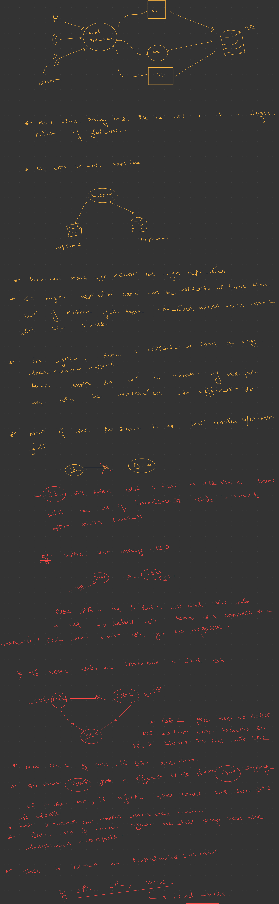
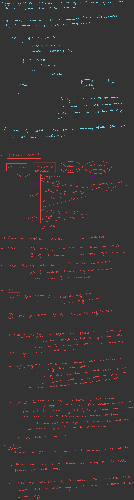

---


# Saga Pattern in Distributed Transactions

# 1. Why Do We Need Saga?

Saga exists because ACID transactions do not work well across multiple microservices.

Suppose we are building Amazon.

User clicks:

```text id="saga1"
Buy Now
```

Business workflow:

```text id="saga2"
1. Create Order
2. Charge Payment
3. Reserve Inventory
4. Create Shipment
```

Looks simple.

---

# 2. Monolith World

In a monolith:

```text id="saga3"
Order Table
Payment Table
Inventory Table
```

all exist inside the same database.

We can simply do:

```sql id="saga4"
BEGIN TRANSACTION

Create Order
Charge Payment
Reserve Inventory

COMMIT
```

If anything fails:

```sql id="saga5"
ROLLBACK
```

Everything returns to previous state.

ACID transaction solves the problem.

---

# 3. Microservice World

Now imagine:

```text id="saga6"
Order Service
    ↓
Order DB

Payment Service
    ↓
Payment DB

Inventory Service
    ↓
Inventory DB

Shipping Service
    ↓
Shipping DB
```

Each service owns its own database.

This is a core microservices principle:

> Database per Service

---

# The Problem

Suppose:

```text id="saga7"
Order Created ✅
Payment Charged ✅
Inventory Failed ❌
```

Now:

* Customer was charged
* Inventory not reserved
* Order incomplete

System is inconsistent.

---

# 4. Why Not Use Distributed Transactions?

Historically systems used:

```text id="saga8"
Two Phase Commit (2PC)
```

---

# Two Phase Commit Flow

Coordinator asks:

```text id="saga9"
Can everyone commit?
```

Services reply:

```text id="saga10"
YES
```

Coordinator then sends:

```text id="saga11"
COMMIT
```

---

# Problems with 2PC

* Slow
* Blocking
* Coordinator becomes bottleneck
* Poor scalability
* Difficult in cloud-native environments
* Service failures are problematic

Most modern distributed systems avoid 2PC.

---

# 5. Saga Pattern Solution

Instead of:

```text id="saga12"
Rollback Entire Transaction
```

Saga uses:

```text id="saga13"
Compensating Transactions
```

This is the core idea.

---

# 6. Core Principle

Every operation has:

```text id="saga14"
Forward Action
```

and

```text id="saga15"
Compensating Action
```

---

# Examples

| Forward Action    | Compensation      |
| ----------------- | ----------------- |
| Create Order      | Cancel Order      |
| Charge Card       | Refund Card       |
| Reserve Inventory | Release Inventory |
| Create Shipment   | Cancel Shipment   |

---

# Key Insight

We do NOT rollback databases.

We execute business-level undo operations.

---

# 7. Amazon Example

User purchases:

```text id="saga16"
iPhone
```

---

## Step 1

Create Order

```text id="saga17"
Order Created
```

---

## Step 2

Charge Payment

```text id="saga18"
Payment Success
```

---

## Step 3

Reserve Inventory

```text id="saga19"
Inventory Reserved
```

---

## Step 4

Create Shipment

Fails.

```text id="saga20"
Shipping Failed
```

---

# Compensation Starts

Execute undo operations in reverse order.

```text id="saga21"
Release Inventory
Refund Payment
Cancel Order
```

System becomes consistent again.

---

# Visualization

```text id="saga22"
Create Order
      ↓
Charge Payment
      ↓
Reserve Inventory
      ↓
Create Shipment
      ❌

Compensation Starts

Release Inventory
      ↑
Refund Payment
      ↑
Cancel Order
```

---

# 8. Why Saga Works

Microservices cannot rollback each other's databases.

Instead:

```text id="saga23"
Service A performs undo
Service B performs undo
Service C performs undo
```

through business logic.

---

# 9. Real World Example — Flight Booking

Workflow:

```text id="saga24"
Book Flight
Book Hotel
Book Cab
```

---

# Success Path

```text id="saga25"
Flight Booked
Hotel Booked
Cab Booked
```

Done.

---

# Failure Path

```text id="saga26"
Flight Booked
Hotel Booked
Cab Failed
```

Compensation:

```text id="saga27"
Cancel Hotel
Cancel Flight
```

Classic Saga example.

---

# 10. Two Types of Saga

There are two implementation styles.

---

# A. Choreography Saga

No central coordinator.

Services communicate through events.

---

# Flow

```text id="saga28"
Order Created Event
         ↓
Payment Service

Payment Completed Event
         ↓
Inventory Service

Inventory Reserved Event
         ↓
Shipping Service
```

Each service reacts to events.

---

# Architecture

```text id="saga29"
Order
  │
  ▼

Kafka

  │
  ▼

Payment

  │
  ▼

Kafka

  │
  ▼

Inventory

  │
  ▼

Kafka

  │
  ▼

Shipping
```

---

# Advantages

* Highly decoupled
* No central controller
* Easy to add new consumers

---

# Disadvantages

As system grows:

```text id="saga30"
20 Services
100 Events
```

becomes difficult to understand.

Known as:

```text id="saga31"
Event Spaghetti
```

Debugging becomes difficult.

---

# B. Orchestration Saga

Most commonly discussed in interviews.

Introduce:

```text id="saga32"
Saga Orchestrator
```

---

# Architecture

```text id="saga33"
Order Request
      │
      ▼

Saga Orchestrator

      │
 ┌────┼────┐
 ▼    ▼    ▼

Payment
Inventory
Shipping
```

---

# Flow

```text id="saga34"
Step1: Create Order
Step2: Charge Payment
Step3: Reserve Inventory
Step4: Create Shipment
```

Orchestrator controls workflow.

---

# Failure Example

```text id="saga35"
Shipping Failed
```

Orchestrator executes:

```text id="saga36"
Release Inventory
Refund Payment
Cancel Order
```

---

# Advantages

* Easier to reason about
* Easier debugging
* Centralized workflow management

---

# Disadvantages

* Additional service to manage
* Orchestrator must be highly available

---

# 11. Netflix Example

Suppose user purchases subscription.

Services:

```text id="saga37"
Subscription Service
Payment Service
Email Service
Recommendation Service
```

---

# Failure Example

Payment fails.

Compensation:

```text id="saga38"
Cancel Subscription
```

If email already sent:

```text id="saga39"
Send Correction Email
```

These are compensating actions.

---

# 12. Uber Example

Workflow:

```text id="saga40"
Reserve Driver
Charge Payment
Create Ride
```

---

# Failure Scenario

Ride creation fails.

Compensation:

```text id="saga41"
Release Driver
Refund Payment
```

Saga restores consistency.

---

# 13. Consistency Model

Important interview question:

> Does Saga provide strong consistency?

Answer:

```text id="saga42"
NO
```

Saga provides:

```text id="saga43"
Eventual Consistency
```

---

# Example

Temporary state may exist:

```text id="saga44"
Payment Charged
Inventory Not Reserved Yet
```

System is temporarily inconsistent.

Eventually:

* Workflow completes
* Or compensation runs

Consistency is restored.

---

# 14. Saga vs ACID Transactions

| ACID Transaction   | Saga Pattern         |
| ------------------ | -------------------- |
| Single Database    | Multiple Services    |
| Rollback           | Compensation         |
| Strong Consistency | Eventual Consistency |
| Fast               | Long Running         |
| Easier             | More Complex         |
| Database-Level     | Business-Level       |

---

# 15. Common Interview Use Cases

Use Saga when business operation spans multiple microservices.

---

## E-Commerce

```text id="saga45"
Order
Payment
Inventory
Shipping
```

---

## Travel Booking

```text id="saga46"
Flight
Hotel
Cab
```

---

## Food Delivery

```text id="saga47"
Order
Restaurant
Driver
Payment
```

---

## Ride Sharing

```text id="saga48"
Driver
Payment
Ride
```

---

## Banking Workflows

```text id="saga49"
Account Service
Audit Service
Notification Service
```

---

# 16. When NOT To Use Saga

If everything lives in:

```text id="saga50"
Single Database
```

Use ACID transactions.

Do not introduce Saga unnecessarily.

---

# 17. Interview Answer Template

If asked:

> How would you handle distributed transactions across microservices?

A strong answer:

> Since each microservice owns its own database, traditional ACID transactions cannot span multiple services. I would use the Saga Pattern where each service performs a local transaction and publishes an event. If a downstream step fails, compensating transactions undo previously completed business operations. This provides eventual consistency while avoiding the scalability and availability issues of two-phase commit.

---

# 18. Senior Engineer Mental Model

Think of Saga as:

```text id="saga51"
Distributed Transaction
          ↓
Sequence of Local Transactions
          ↓
Each Step Has Compensation
          ↓
Failure Triggers Compensation Chain
          ↓
System Returns To Consistent State
```

---

# Final Takeaway

The most important thing to remember:

> Saga does NOT rollback database transactions.

Instead:

```text id="saga52"
Forward Action
       +
Compensating Action
```

is used to achieve:

```text id="saga53"
Eventual Consistency
```

across multiple microservices while keeping services loosely coupled and independently scalable.
